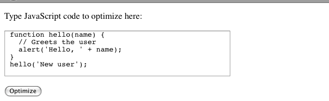
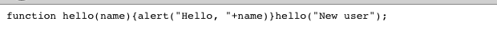

# Getting Started with the API
  
## The Hello World of the Closure Compiler Service API

The [Closure Compiler Service UI](ui.md) is good place to start for a few lines of JavaScript code
or a few URLs, but if you'd like to automate the JavaScript optimization process or build the
optimization process into a larger system (e.g. an IDE extension), then you should talk directly to
the Closure Compiler service API. Follow the steps below for the Hello World of the Closure
Compiler service API:

 1. **Create an HTML page**
    
    Create a file called closure_compiler_test.html and paste in this code:
    
    ```html
    <html>
      <body>
        <form action="http://closure-compiler.appspot.com/compile" method="POST">
        <p>Type JavaScript code to optimize here:</p>
        <textarea name="js_code" cols="50" rows="5">
        function hello(name) {
          // Greets the user
          alert('Hello, ' + name);
        }
        hello('New user');
        </textarea>
        <input type="hidden" name="compilation_level" value="WHITESPACE_ONLY">
        <input type="hidden" name="output_format" value="text">
        <input type="hidden" name="output_info" value="compiled_code">
        <br><br>
        <input type="submit" value="Optimize">
        </form>
      </body>
    </html>
    ```
    
    The form on this page gives you a simple (if contrived) way to invoke the Closure Compiler
    service API using an HTTP POST request.

    Note that the compilation_level parameter is set to WHITESPACE_ONLY, which tells the Closure
    Compiler service to apply the most basic optimizations to the code. You can set this
    parameter's value to SIMPLE_OPTIMIZATIONS or ADVANCED_OPTIMIZATIONS to try more advanced levels
    of optimization. For more information about these compilation levels, see the API Reference.

 2. **Open the page in your browser**

    Now open closure_compiler_test.html in your browser. You should see a page that looks like the
    screenshot below: 


 3. **Click "Optimize" to submit the code to the Closure Compiler Service API**

    You should see this resulting code, with comments and whitespace removed:
    

    The optimized version of the JavaScript code is functionally equivalent to the original code
    and is much smaller. You can cut and paste the output from this page back into your source file.

Now that you've seen the basics of the Closure Compiler service API, you can learn more about how
to use and configure it in [Communicating with the Closure Compiler Service API](api-tutorial-1.md).
