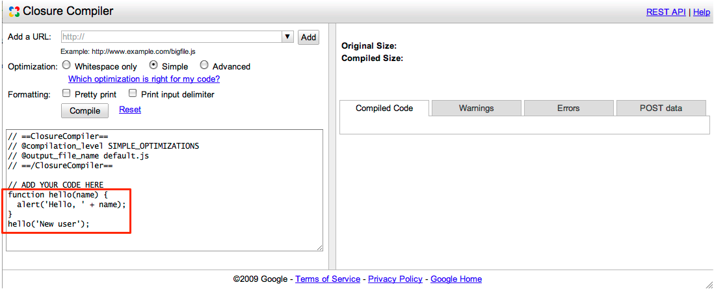
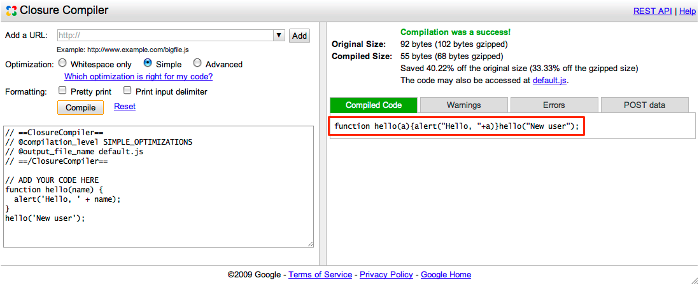
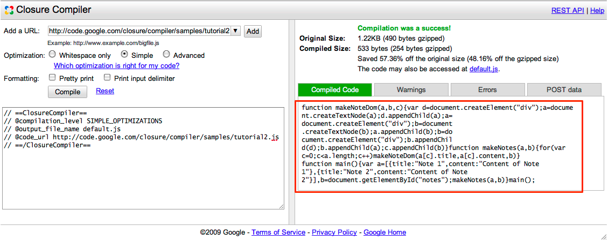

# Getting Started with the UI

## The Hello World of the Closure Compiler Service UI

The easiest way to get familiar with the Closure Compiler service is by optimizing a few simple
functions in the service's web UI.

 1. Access the Closure Compiler UI by opening this page in another tab or window:
    [http://closure-compiler.appspot.com](http://closure-compiler.appspot.com).
 2. You should see the Closure Compiler UI prepopulated with a simple Hello World function:
    
 3. Click "Compile" to see the result: 

That's it! You now have a much smaller version of the JavaScript code that functions identically to
the original. The Closure Compiler service reduced the code from 92 bytes to just 55 bytes by
removing comments and whitespace and renaming basic symbols.

For your convenience, the Closure Compiler service hosts the output file `default.js` on its
servers for one hour. You can access the URL of the output file by copying the location of the link
that's provided above the output pane, where it says **The code may also be accessed at
{filename}**. If you make any changes to the original JavaScript code and re-optimize it during
that hour, Closure Compiler service overwrites the output file with the new results as long as you
leave the `@output_file_name` parameter unchanged at the top of the input field. You can use this
feature as a quick way to test your compiled code by linking directly to the file from your test
application. Do not link to it from production servers.

*Note: To prevent abuse, the Closure Compiler limits the number of consecutive compiles that you
can run. If you see the message Too many compiles performed recently. Try again later, it means
you've temporarily exceeded the limit.*

## Optimize a JavaScript file

You can also optimize the contents of one or more JavaScript files using the Closure Compiler UI.

 1. Copy and paste the URL `http://developers.google.com/closure/compiler/samples/tutorial2.js` into
    the **Add a URL** box. This file contains unoptimized code for creating nodes in a DOM tree.
 2. Click **Add**. (If you had more than one file to add, repeat Steps 1 and 2 until you've added
    all of them. You can also type the file name(s) directly into the text area if you prefer.)
 3. If you want the Closure Compiler service to serve the compressed file, choose a name for the
    output file using the `@output_file_name` parameter at the top of the input field. Note that
    the default for the output file name is `default.js` but you should change it to a more
    meaningful name for your project. Also note that the Closure Compiler service hosts the output
    file on its servers for an hour.
 4. Click **Compile**.

You should see the optimized JavaScript in the right hand panel, like this:

To use the optimized code, you can cut and paste it into your source file, download the file into
your directory, or link to the file directly in your script tag (for up to one hour).

You have just worked through examples of optimizing simple functions in the Closure Compiler
service UI. Check out the
[wiki](https://github.com/google/closure-compiler/wiki/Additional%20Webservice%20Options) for some
additional webservice options.

If you'd like to build the Closure Compiler service's JavaScript optimization process into a larger
system, then you should talk directly to the Closure Compiler service API. Learn more at [Getting
Started with the Closure Compiler Service API](api.md).
