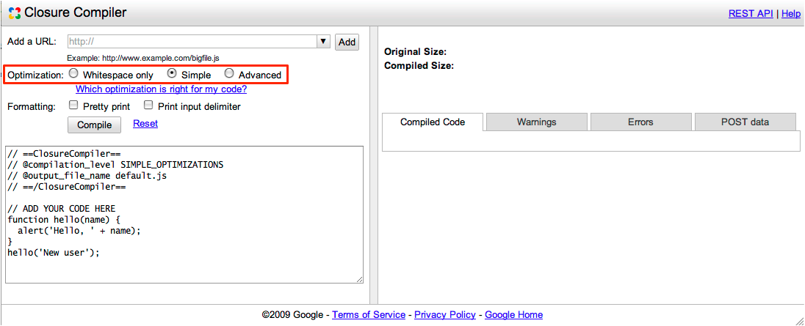

# Closure Compiler Compilation Levels

The Closure Compiler lets you choose from three levels of compilation, ranging from simple removal
of whitespace and comments to aggressive code transformations.

## WHITESPACE_ONLY

The `WHITESPACE_ONLY` compilation level removes comments from your code and also removes line
breaks, unnecessary spaces, extraneous punctuation (such as parentheses and semicolons), and other
whitespace. The output JavaScript is functionally identical to the source JavaScript.

This compilation level provides the least compression of the three levels.

## SIMPLE_OPTIMIZATIONS

The `SIMPLE_OPTIMIZATIONS` compilation level performs the same whitespace and comment removal as
`WHITESPACE_ONLY`, but it also performs optimizations within expressions and functions, including
renaming local variables and function parameters to shorter names. Renaming variables to shorter
names makes code significantly smaller. Because the `SIMPLE_OPTIMIZATIONS` level renames only
symbols that are local to functions, it does not interfere with the interaction between the
compiled JavaScript and other JavaScript.

Compilation with `SIMPLE_OPTIMIZATIONS` always preserves the functionality of syntactically valid
JavaScript, provided that the code does not access local variables using string names (by using
`eval()` statements, for example, or by calling `toString` on functions).

`SIMPLE_OPTIMIZATIONS` is the default compilation level.

## ADVANCED_OPTIMIZATIONS

The `ADVANCED_OPTIMIZATIONS` compilation level performs the same transformations as
`SIMPLE_OPTIMIZATIONS`, but adds a variety of more aggressive global transformations to achieve the
highest compression of all three levels. The `ADVANCED_OPTIMIZATIONS` level compresses JavaScript
well beyond what is possible with other tools.

To enable this extreme compression, `ADVANCED_OPTIMIZATIONS` makes strong assumptions about the
compiled code. If your code does not conform to those assumptions, `ADVANCED_OPTIMIZATIONS` will
produce code that does not run.

For example, code compiled with `ADVANCED_OPTIMIZATIONS` may not work with uncompiled code unless
you take special steps to ensure interoperability. If you do not flag external functions and
properties referenced in your code, Closure Compiler will inappropriately rename references in your
code, causing mismatches between the names in your code and in the external code.

To learn more about how to prepare your code for `ADVANCED_OPTIMIZATIONS`, read Advanced
Compilation and Externs.

The `ADVANCED_OPTIMIZATIONS` transformations include:

 * *more aggressive renaming:*

    Compilation with `SIMPLE_OPTIMIZATIONS` only renames parameters and variables within functions.
    `ADVANCED_OPTIMIZATIONS` also renames global variables, function names, and properties.

 * *dead code removal:*
 
    Compilation with `ADVANCED_OPTIMIZATIONS` removes code that is provably unreachable. This is
    especially useful in combination with large libraries. If you use only a few functions from a
    large library file, the compiler can remove everything except those functions from its output.

 * *global inlining:*
 
    Compilation with `ADVANCED_OPTIMIZATIONS` replaces some function calls with the body of the
    function. This transformation is known as "inlining". The compiler only inlines functions when
    it determines that inlining is safe and saves space. Compilation with `ADVANCED_OPTIMIZATIONS`
    also inlines constants and some variables when the compiler determines that it can do so safely.

## How to Set the Compilation Level

The Closure Compiler service UI, service API, and application all have different methods for
setting the compilation_level.

### In the Closure Compiler service UI

To set the compilation level in the Closure Compiler service UI, click on the radio buttons in the
**Optimization** section of the interface.



### In the Closure Compiler service API

To set the compilation level in the Closure Compiler service API, include a request paramete
named `compilation_level` with a value of `WHITESPACE_ONLY`, `SIMPLE_OPTIMIZATIONS`, or
`ADVANCED_OPTIMIZATIONS`, as in the following python program:

```python
#!/usr/bin/python2.4

import httplib, urllib, sys

params = urllib.urlencode([
    ('code_url', sys.argv[1]),
    ('compilation_level', 'ADVANCED_OPTIMIZATIONS'),
    ('output_format', 'text'),
    ('output_info', 'compiled_code'),
  ])

headers = { "Content-type": "application/x-www-form-urlencoded" }
conn = httplib.HTTPConnection('closure-compiler.appspot.com')
conn.request('POST', '/compile', params, headers)
response = conn.getresponse()
data = response.read()
print data
conn.close()
```

### In the Closure Compiler application

To set the compilation level in the Closure Compiler application, include the command line flag
`--compilation_level` with a value of `WHITESPACE_ONLY`, `SIMPLE`, or `ADVANCED`, as in the
following command:

```
java -jar compiler.jar --compilation_level ADVANCED_OPTIMIZATIONS --js hello.js
```
